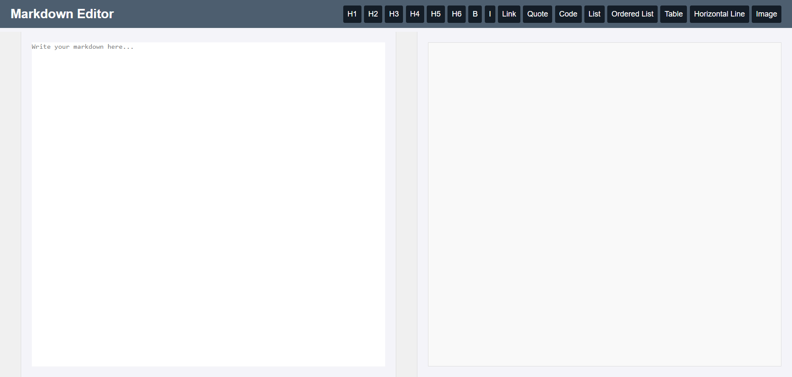

# Markdown Editor

Um editor de Markdown simples e interativo, com visualização em tempo real, desenvolvido com HTML, CSS e JavaScript. O editor permite que o usuário escreva texto em Markdown e veja a pré-visualização do texto formatado simultaneamente.

## Funcionalidades

- **Editor de Markdown**: Escreva em sintaxe Markdown e veja a formatação aplicada.
- **Visualização ao vivo**: A pré-visualização do Markdown é atualizada em tempo real conforme o texto é digitado.
- **Barra de ferramentas**: Inclui botões para adicionar cabeçalhos, negrito, itálico, links, citações, código, listas e outros elementos Markdown.
- **Contagem de linhas**: Exibe o número de linhas no editor e no visualizador para facilitar a navegação.
- **Sincronização de rolagem**: A rolagem do editor e do visualizador é sincronizada para uma melhor experiência de usuário.

## Tecnologias Utilizadas

- **HTML5**: Estrutura do editor e do visualizador.
- **CSS3**: Estilização da interface, incluindo layout e barra de ferramentas.
- **JavaScript**: Lógica de conversão de Markdown para HTML, atualização ao vivo da visualização e sincronização de rolagem entre o editor e o visualizador.

## Captura de Tela



## Como Usar

1. **Editor**: Escreva texto em Markdown na área de edição. Use os botões na barra de ferramentas para adicionar formatação rapidamente.
2. **Visualização**: Veja o conteúdo formatado à direita do editor em tempo real.
3. **Botões de Formatação**:
   - `H1`, `H2`, ... `H6`: Adiciona diferentes níveis de cabeçalhos.
   - `B`: Adiciona negrito ao texto selecionado.
   - `I`: Adiciona itálico ao texto selecionado.
   - `Link`: Adiciona um link com texto e URL.
   - `Quote`: Adiciona uma citação (blockquote).
   - `Code`: Adiciona um bloco de código.
   - `List`: Adiciona um item de lista não ordenada.
   - `Ordered List`: Adiciona um item de lista ordenada.
   - `Table`: Insere uma tabela básica.
   - `Horizontal Line`: Adiciona uma linha horizontal.
   - `Image`: Insere uma imagem com texto alternativo.

## Instalação

1. Clone este repositório:
   ```bash
   git clone https://github.com/seu-usuario/markdown-editor.git
   ```
2. Navegue até o diretório do projeto:
   ```bash
   cd markdown-editor
   ```
3. Abra o arquivo `index.html` no seu navegador para usar o editor de Markdown.

## Estrutura do Projeto

```plaintext
markdown-editor/
├── index.html         # Estrutura principal do editor e visualizador
├── style.css          # Estilos CSS para layout e formatação
├── script.js          # Lógica do JavaScript para conversão e sincronização
└── README.md          # Informações sobre o projeto
```

## Customização

Você pode personalizar este editor de Markdown conforme suas necessidades:

- **Estilos CSS**: Modifique o arquivo `style.css` para alterar cores, tamanhos e espaçamento do layout.
- **Botões e Funcionalidades**: Edite o arquivo `index.html` e adicione novos botões ou altere os existentes.
- **Conversão de Markdown**: No arquivo `script.js`, você pode ajustar as expressões regulares na função de conversão de Markdown para HTML para adicionar mais funcionalidades ou melhorar a conversão.

## Contribuição

Contribuições são bem-vindas! Se você tiver sugestões ou melhorias, sinta-se à vontade para abrir uma *issue* ou enviar um *pull request*.

## Licença

Este projeto é licenciado sob a licença MIT - veja o arquivo [LICENSE](LICENSE) para mais detalhes.

## Agradecimentos

Agradecemos a todos que contribuíram para o desenvolvimento e melhoria deste projeto.

---

**Observação**: Este projeto é um exemplo básico de um editor de Markdown. Para um editor completo e robusto, considere usar bibliotecas dedicadas como [Markdown-it](https://github.com/markdown-it/markdown-it) ou [Showdown](https://github.com/showdownjs/showdown).
